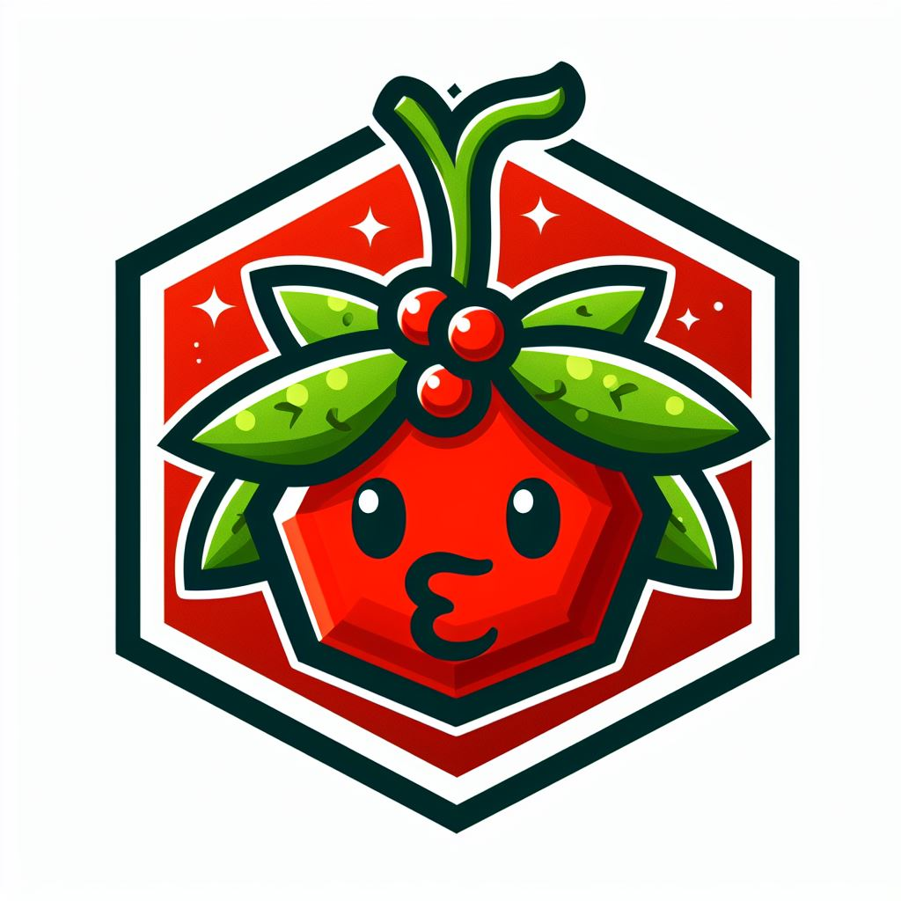

# Mistletoe (WIP) - Polyglot Kubernetes Package Manager

**Mistletoe** is a Kubernetes package manager that goes about things in a different way than the rest of the ecosystem.  There are some great package managers already out there that we'll have to catch up to, notably Helm.  The best way to distinguish the two is to talk about what the packages themselves look like.

## Run WASM, Get Kubernetes YAML

[Helm](https://github.com/helm/helm) Charts are YAML templates in the Golang templating language.  It's very similar to writing Kubernetes resources themselves -- you write the resources, receiving input configuration from the engine that you can use in the template logic.

**Mistletoe** modules are WebAssembly modules with one entrypoint.  The package developer writes a function in their language of choice that takes in a YAML input string and outputs Kubernetes resource YAML.  Essentially, the developer is welcome to do *anything* they want assuming it fits in the sandbox.

## What does it look like for developers?

That depends on what the developer wants to do.  It turns out that pretty much any language that has a YAML parsing library works almost perfectly.  Ultimately, all we're doing is taking a string and returning a string.

To give a more concrete example, here's a simple Rust snippet:

```rust
misthusk_headers! {"
  name: example-namespace
  labels:
    mistletoe.dev/group: mistletoe-examples
"}

#[derive(Deserialize)]
struct InputConfig {
    name: String,
}

pub fn generate(input_config: InputConfig) -> MistHuskResult {
    let output = MistHuskOutput::new()
        .with_file("namespace.yaml".to_string(), formatdoc!{"
            ---
            apiVersion: apps/v1
            kind: Namespace
            metadata:
              name: {0}
        ", input_config.name});

    Ok(output)
}
```

The above example takes a single-line input YAML, e.g. `name: my-namespace`, and spits out a Namespace with that name.  It makes use of some library support I've provided for Rust, and I'll be improving how that looks as time goes on, but its worth noting that there's not a whole lot I *can* provide given how simple it already is.

## Where are things at now?

Right now, there's just a whole lotta prototype code, nothing coherent.  But given how quickly its coming along, I don't expect it'll be long until there's something usable.  I'll be providing more updates, documentation, and write-ups on where I want this to go, but right now I'm only shopping for interest before I really start pouring some sweat into it.
